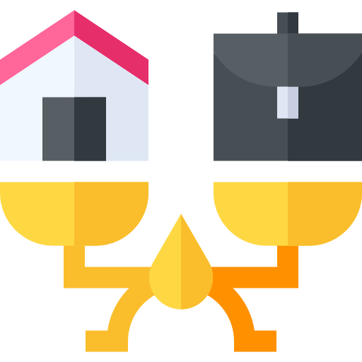

<!-- PROJECT LOGO -->
 

  

  <h3 align="center"><strong>Carpeta "Dataset"</strong></h3>

  

    Proyecto final para el modulo "Procesamiento de datos con Python"
  

  

  
  
  
  
  

## Información de la carpeta

En la siguiente carpeta se encuentran los _DataSets_ con la información que se utilizo para el calculo del IDH. 

Solo se menciona que en el __Notebook final__, se extrajeron los datos de una API.